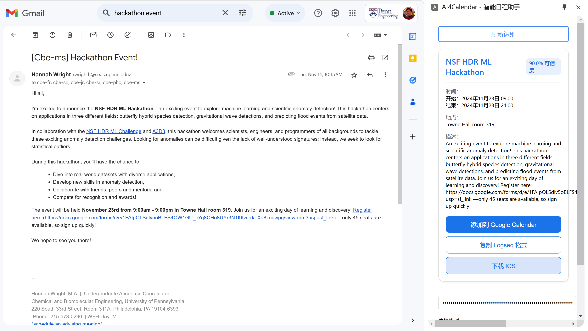
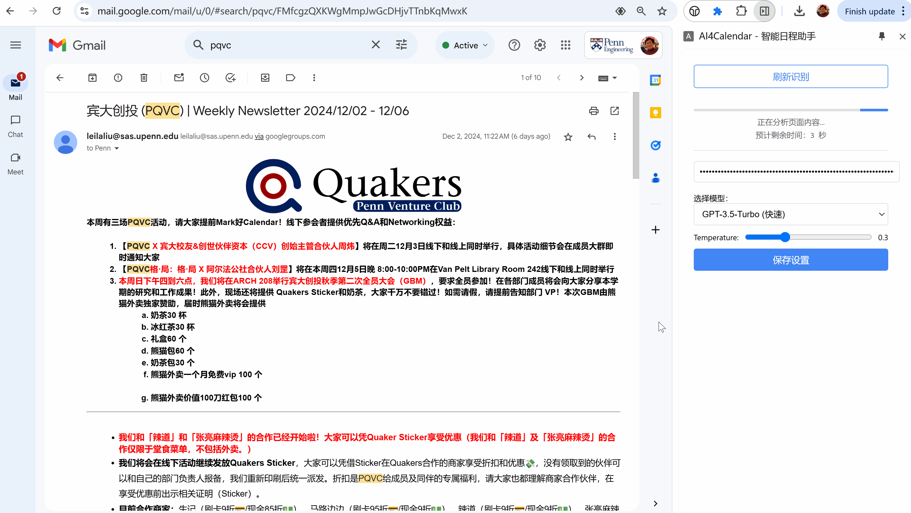

# AI4Calendar Chrome Extension

AI4Calendar is an intelligent Chrome extension that automatically detects schedule information on webpages (supports multiple events at once) and provides quick options to add them to Google Calendar or copy them to Logseq.

[English](./README.md) | [中文](./README_zh.md)

## Key Features

- AI-based recognition: Automatically detects schedule information using AI  
- Quick add: One-click to add events to Google Calendar  
- ICS download: Supports exporting standard ICS calendar files  
- Logseq integration: Copies events in standard Logseq task format  
- Multi-scenario support: Works with emails, webpages, and other text sources  
- No authorization required: Uses Google Calendar quick-add links without account permissions  

<!--  -->


## Installation

1. Download the source code of this extension  
2. Open Chrome and navigate to `chrome://extensions/`  
3. Enable "Developer mode"  
4. Click "Load unpacked"  
5. Select the extension folder  

## Usage

1. Configure OpenAI API Key:  
   - Click the extension icon  
   - Enter your OpenAI API Key in the settings  
   - Choose the desired model (GPT-5 Mini recommended for balanced performance)

2. Detect schedules:  
   - Open a webpage that contains schedule or event information  
   - Click the extension icon  
   - Wait for AI to extract schedule data  
   - Review the identified events  

3. Add to calendar:  
   - Click "Add to Google Calendar"  
   - Confirm details on the opened Google Calendar page  
   - Click "Save"  
   - Or click "Download ICS" to export a standard calendar file  

4. Copy to Logseq:  
   - Click "Copy Logseq Format"  
   - Paste directly into Logseq  

## Logseq Format Example

```markdown
- TODO Event Title @Location #Event
  SCHEDULED: <2024-12-08 Sun 14:00>
  :AGENDA:
  estimated: 1h
  :END:
````

## Version History

### v0.5.1 (Latest)
- 🚀 Upgraded to GPT-5 series models (faster and more cost-effective)
- ✨ Added GPT-5 Nano (Fast), GPT-5 Mini (Balanced), GPT-5 (Powerful)
- 🔧 Removed legacy GPT-4o models
- 💡 Default model changed to GPT-5 Mini for optimal performance

### v0.5.0
- Optimized multi-email handling to fully extract email thread context
- Improved extraction of email subject and sender details to increase event recognition accuracy
- Refined email content processing and optimized AI model input formatting
- New structured-data processing pipeline to improve recognition in complex scenarios

### v0.4.4

* Added optional image recognition support
* Improved extraction algorithms to handle schedule data from images
* Added user configuration option to enable or disable image recognition
* 

### v0.4.3

* Improved email content parsing and automatic meeting link extraction

### v0.4.0

* Added ICS file download feature
* Added download button to event cards
* Supported exporting standard ICS calendar files

### v0.3.0

* Fixed Logseq copy feature for single event selection
* Optimized Logseq output format with standard indentation

### v0.2.0

* Simplified user interface
* Removed authorization-dependent features
* Set quick-add as the primary functionality

### v0.1.0

* Initial release with basic calendar features

## Tech Stack

* JavaScript (ES6+)
* Chrome Extension APIs
* OpenAI API (GPT-5 series)
* Google Calendar API (Quick Add)

## Development

This extension is developed entirely in pure JavaScript with no frontend frameworks.

* `manifest.json`: Extension configuration file
* `content.js`: Webpage content detection logic
* `sidebar.js`: Sidebar and UI interaction logic
* `calendar-api.js`: Calendar-related functions
* `utils/`: Utility function directory

## Notes

1. You must provide your own OpenAI API Key
2. Detection accuracy depends on the webpage’s structure and clarity
3. Default timezone is set to America/New_York

## Contribution

Contributions via Issues and Pull Requests are welcome. Please ensure the following before submitting:

1. Consistent coding style
2. Proper documentation for new features
3. All existing features remain functional

## License

MIT License

